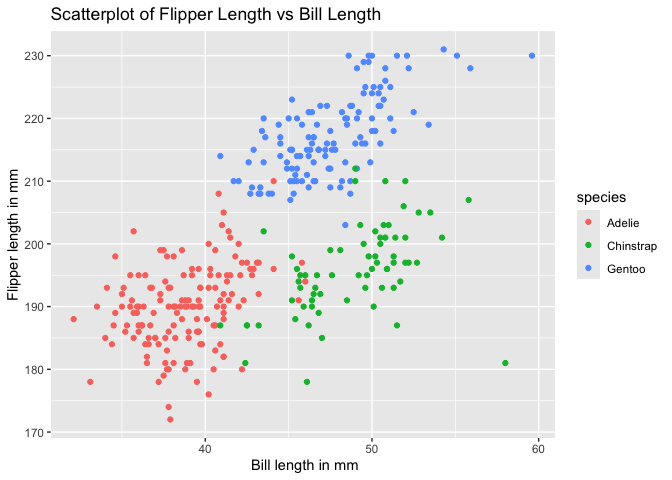

Homework 1
================
Mingyin Wang
2024-09-18

This document contains the code for Homework 1 in P8105

# Problem 1

### load the penguins dataset

``` r
data("penguins", package = "palmerpenguins")
```

### Code to get the numbers of rows, columns and mean of flipper_length_mm column

``` r
dataset_rows <- nrow(penguins)
dataset_cols <- ncol(penguins)
mean_flipper_length = mean(penguins |> pull(flipper_length_mm), na.rm = TRUE) 
```

The important variables are `species`, `bill_length_mm`, and
`flipper_length_mm`. The penguins data set contains 344 rows and 8
columns. The mean flipper length is 200.92 mm.

### Make a scatter plot of flipper_length_mm (y) vs bill_length_mm (x) and save it

``` r
ggplot(penguins, aes(x = bill_length_mm, y = flipper_length_mm, color = species)) + 
  geom_point() + labs(
    x = " Bill length in mm", 
    y = "Flipper length in mm", 
    title = "Scatterplot of Flipper Length vs Bill Length"
  )
```

    ## Warning: Removed 2 rows containing missing values or values outside the scale range
    ## (`geom_point()`).

<!-- -->

``` r
ggsave("penguins_scatterplot.pdf", height = 4, width = 6)
```

    ## Warning: Removed 2 rows containing missing values or values outside the scale range
    ## (`geom_point()`).

# Question 2

### create the data frame

``` r
set.seed(1)  
df = data.frame(
  random_sample = rnorm(10), 
  logical_vector = rnorm(10) > 0,
  character_vector = sample(letters, 10),
  factor_vector = factor(sample(c("Level1", "Level2", "Level3"), 10,  replace = TRUE))  
)
```

### take the mean of each variable

``` r
mean_random_sample = mean(pull(df, random_sample) )
mean_logical_vector = mean(pull(df, logical_vector) )
mean_character_vector = mean(pull(df, character_vector) )
```

    ## Warning in mean.default(pull(df, character_vector)): argument is not numeric or
    ## logical: returning NA

``` r
mean_factor_vector = mean(pull(df, factor_vector) )
```

    ## Warning in mean.default(pull(df, factor_vector)): argument is not numeric or
    ## logical: returning NA

The random_sample and logical vector work, since random_sample is
numeric and logical vector contains true and false, which are 1 and 0
respectively. The character vectors and factor vectors do not work,
since we cannot take the average of characters. Factors are categorical,
we also cannot take the average of it.

### convert variable to numeric

``` r
numeric_logical_vector = as.numeric(pull(df, logical_vector))
numeric_character_vector = as.numeric(pull(df, character_vector))
```

    ## Warning: NAs introduced by coercion

``` r
numeric_factor_vector = as.numeric(pull(df, factor_vector))
```

For the Logical vector, true becomes 1 and false becomes 0, then we
could calculate the mean

For the character vector, the conversion does not work and returns NA
values, since characters cannot be directly converted to numeric.

For the factor vector,the conversion to numeric works, but the numeric
values 1, 2, 3 correspond to the factor levels, level 1, level 2, level
3. When we take the average of factor vector, the mean of factor vector
is not meaningful.
